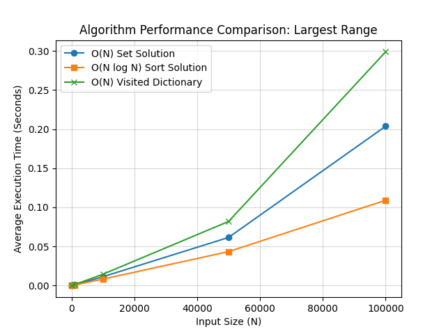
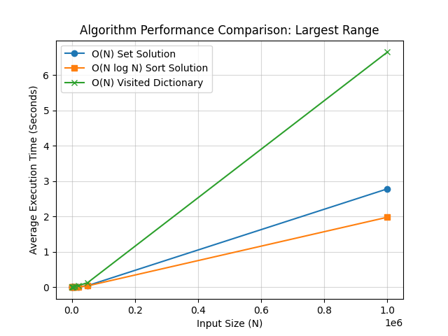

Python specific solution:

Key Observations from the Plot
 - X-Axis (Input Size $N$): Represents the number of elements in the array, ranging from 0 to 100,000.
 - Y-Axis (Average Execution Time): Measured in seconds, showing the actual time taken to resolve the problem for a given $N$.

| Color | Label  | Theoretical Complexity  | Performance Analysis  |
|---|---|---|---|
| Green  | O(N) Visited Dictionary  | Linear (O(N))  | Slowest. Despite being theoretically linear, this approach has the highest ""constant factor"" due to the overhead of multiple dictionary writes and bidirectional lookups for every element.  |
| Blue  | O(N) Set Solution  | Linear (O(N))  | Middle. This approach is faster than the dictionary because it optimizes for ""range anchors"" (only starting a search if num−1 is not in the set), significantly reducing redundant operations.  |
| Orange  | O(NlogN) Sort Solution  | Log-Linear (O(NlogN))  | Fastest. Counter-intuitively, the sorting approach performs best in this range (N≤100k) because Python’s .sort() is implemented in C and leverages CPU cache locality, making its individual operations much faster than high-level Python set/dict lookups."  |

Why the $O(N \log N)$ Solution Appears Faster:
1. **Hardware Locality vs. Hashing Overhead**
Modern CPUs are optimized for spatial locality—accessing data that is right next to each other in memory.
 - Sorting (Sequential Access): Python’s sort() (Timsort) moves elements into a contiguous array. As the algorithm iterates through the sorted numbers, the CPU pre-fetches the next blocks of data into its L1/L2 cache before they are even requested.
 - Sets (Random Access): A set uses a hash table. To find the "next" number in a range, the set must calculate a hash and jump to a random location in memory. At 5 million elements, the hash table is too large for the CPU cache, causing constant "cache misses" where the CPU must wait for the much slower RAM.
2. **Timsort is Written in C, Not Python**
While both algorithms run in Python, their internal execution is very different:
 - .sort() is a C-extension: Almost the entire sorting process happens in highly optimized C. This means thousands of machine-level operations happen in the time it takes Python to execute a single high-level for loop or if statement.
 - Set Solution is Python-heavy: Your set-based solution uses a Python-level for loop and multiple Python if checks per element. The interpreter overhead for these operations often outweighs the theoretical efficiency of the $O(N)$ logic.
3. **The Memory Tax**
Python integers and sets are "boxed" objects, meaning they carry extra metadata.
- Set Overhead: A Python set often requires 4x to 15x more memory than a raw integer to store the hash, pointers, and the value itself.
- Resizing Costs: As you add 5 million items to a set, it must frequently "resize" and "rehash," which involves allocating a new, larger memory block and moving every single existing entry—a very expensive operation that happens $O(\log N)$ times.

| Factor  |  $O(N)$ Set Solution | $O(N \log N)$ Sort Solution  | 
|---|---|---|
| Execution Language  | High-level Python Loops  | Optimized C (Timsort)  |
| Memory Access  | Random (High Cache Misses)  | Sequential (Cache Friendly)  |
| Operations  | Hashing + Rehashing  | In-place Swaps + Comparisons  |
| Best Case  | Bounded by hashing speed  | Linear $O(N)$ on mostly sorted data  |
